# EXI.AI-Q-V1 APP

This repository, developed by Stefan Pietrusky, deals with a prototype that circumvents the problem of computationally intensive image neural networks or computer vision pipelines by storing the image content as simple text metadata that an LLM refers to during communication. Depending on the image, appropriate questions are generated, which are answered by the user and evaluated by the app without consuming high computing power. 

The metadata for JPEG and GIF files is implemented using the external tool [ExifTool](https://exiftool.org/). Since PNG files do not recognize EXIF segments but store them in chunks, Pillow is used here. 

## EXI.AI-Q Structure
The structure of the current [V1] EXI.AI-Q app is shown below.


## EXI.AI-Q working principle
Below is a short GIF showing the structure and function of the app.


## Installing and running the application 
1. Clone this repository on your local computer: 
```bash 
git clone https://github.com/stefanpietrusky/EXI.AI-Q
```
2. Install the required dependencies:
```bash 
pip install -r requirements.txt
```
3. Install [Ollama](https://ollama.com/) and load a model for example [Llama3.2](https://ollama.com/library/llama3.2) (3B). Alternatively, another model can be used.
```bash 
ollama pull llama3.2
```
4. If you encounter issues with meta responses or the non-deterministic outputs of the model, you will need to adjust the parameters (temperature, seed, and top_p) of the LLM using a modelfile. An [example](https://github.com/stefanpietrusky/EXI.AI-Q/blob/main/modelfile.txt) can be found in the repository.
5. Install the [ExifTool](https://exiftool.org/) for your system.
6. Install Python [3.10.11](https://www.python.org/downloads/release/python-31011/).
7. Adjust the paths for ExifTool, the image directories, and the LLM designation in the code.
8. Create a file for the metadata or use the [template](https://github.com/stefanpietrusky/EXI.AI-Q/blob/main/metadata.txt) in the repository.
9. Implement the metadata into the corresponding images.
```bash 
python metadata.py
```
10. Start the EXI.AI-Q V1 app.
```bash 
python app.py
```
